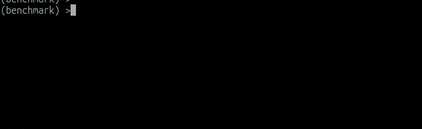

# Benchmark utils

Utils for benchmark - wrapper over python timeit.

[](https://pypi.org/project/benchmark-utils/)
[](https://badge.fury.io/py/benchmark-utils)  
[](https://github.com/ayasyrev/benchmark_utils/actions?workflow=Tests)  [](https://codecov.io/gh/ayasyrev/benchmark_utils)  

Tested on python 3.7 - 3.12

## Install

Install from pypi:  

`pip install benchmark_utils`

Or install from github repo:

`pip install git+https://github.com/ayasyrev/benchmark_utils.git`

## Basic use.

Lets benchmark some (dummy) functions.


```python
from time import sleep


def func_to_test_1(sleep_time: float = 0.1, mult: int = 1) -> None:
    """simple 'sleep' func for test"""
    sleep(sleep_time * mult)


def func_to_test_2(sleep_time: float = 0.11, mult: int = 1) -> None:
    """simple 'sleep' func for test"""
    sleep(sleep_time * mult)
```

Let's create benchmark.


```python
from benchmark_utils import Benchmark
```


```python
bench = Benchmark(
    [func_to_test_1, func_to_test_2],
)
```


```python
bench
```
<details open> <summary>output</summary>  
    <pre>
    Benchmark(func_to_test_1, func_to_test_2)
    </pre>
</details>


Now we can benchmark that functions.


```python
# we can run bench.run() or just:
bench()
```
<details open> <summary>output</summary>  
    <pre style="white-space:pre;overflow-x:auto;line-height:normal;font-family:Menlo,'DejaVu Sans Mono',consolas,'Courier New',monospace"> Func name  | Sec <span style="color: #800080; text-decoration-color: #800080">/</span> run
</pre>


<pre style="white-space:pre;overflow-x:auto;line-height:normal;font-family:Menlo,'DejaVu Sans Mono',consolas,'Courier New',monospace">func_to_test_1:   <span style="color: #008080; text-decoration-color: #008080; font-weight: bold">0.10</span> <span style="color: #008080; text-decoration-color: #008080; font-weight: bold">0.0</span>%
</pre>


<pre style="white-space:pre;overflow-x:auto;line-height:normal;font-family:Menlo,'DejaVu Sans Mono',consolas,'Courier New',monospace">func_to_test_2:   <span style="color: #008080; text-decoration-color: #008080; font-weight: bold">0.11</span> <span style="color: #008080; text-decoration-color: #008080; font-weight: bold">-8.9</span>%
</pre>

</details>


We can run it again, all functions, some of it, exclude some and change number of repeats.


```python
bench.run(num_repeats=10)
```
<details open> <summary>output</summary>  
    <pre style="white-space:pre;overflow-x:auto;line-height:normal;font-family:Menlo,'DejaVu Sans Mono',consolas,'Courier New',monospace"> Func name  | Sec <span style="color: #800080; text-decoration-color: #800080">/</span> run
</pre>


<pre style="white-space:pre;overflow-x:auto;line-height:normal;font-family:Menlo,'DejaVu Sans Mono',consolas,'Courier New',monospace">func_to_test_1:   <span style="color: #008080; text-decoration-color: #008080; font-weight: bold">0.10</span> <span style="color: #008080; text-decoration-color: #008080; font-weight: bold">0.0</span>%
</pre>


<pre style="white-space:pre;overflow-x:auto;line-height:normal;font-family:Menlo,'DejaVu Sans Mono',consolas,'Courier New',monospace">func_to_test_2:   <span style="color: #008080; text-decoration-color: #008080; font-weight: bold">0.11</span> <span style="color: #008080; text-decoration-color: #008080; font-weight: bold">-9.3</span>%
</pre>

</details>


After run, we can prunt results - sorted or not, reversed, compare results with best or not. 


```python
bench.print_results(reverse=True)
```
<details open> <summary>output</summary>  
    <pre style="white-space:pre;overflow-x:auto;line-height:normal;font-family:Menlo,'DejaVu Sans Mono',consolas,'Courier New',monospace"> Func name  | Sec <span style="color: #800080; text-decoration-color: #800080">/</span> run
</pre>


<pre style="white-space:pre;overflow-x:auto;line-height:normal;font-family:Menlo,'DejaVu Sans Mono',consolas,'Courier New',monospace">func_to_test_2:   <span style="color: #008080; text-decoration-color: #008080; font-weight: bold">0.11</span> <span style="color: #008080; text-decoration-color: #008080; font-weight: bold">0.0</span>%
</pre>


<pre style="white-space:pre;overflow-x:auto;line-height:normal;font-family:Menlo,'DejaVu Sans Mono',consolas,'Courier New',monospace">func_to_test_1:   <span style="color: #008080; text-decoration-color: #008080; font-weight: bold">0.10</span> <span style="color: #008080; text-decoration-color: #008080; font-weight: bold">10.2</span>%
</pre>

</details>


We can add functions to benchmark as list of functions (or partial) or as dictionary: `{"name": function}`.


```python
bench = Benchmark(
    [
        func_to_test_1,
        partial(func_to_test_1, 0.12),
        partial(func_to_test_1, sleep_time=0.11),
    ]
)
```


```python
bench
```
<details open> <summary>output</summary>  
    <pre>
    Benchmark(func_to_test_1, func_to_test_1(0.12), func_to_test_1(sleep_time=0.11))
    </pre>
</details>


```python
bench.run()
```
<details open> <summary>output</summary>  
    <pre style="white-space:pre;overflow-x:auto;line-height:normal;font-family:Menlo,'DejaVu Sans Mono',consolas,'Courier New',monospace"> Func name  | Sec <span style="color: #800080; text-decoration-color: #800080">/</span> run
</pre>


<pre style="white-space:pre;overflow-x:auto;line-height:normal;font-family:Menlo,'DejaVu Sans Mono',consolas,'Courier New',monospace">func_to_test_1:   <span style="color: #008080; text-decoration-color: #008080; font-weight: bold">0.10</span> <span style="color: #008080; text-decoration-color: #008080; font-weight: bold">0.0</span>%
</pre>


<pre style="white-space:pre;overflow-x:auto;line-height:normal;font-family:Menlo,'DejaVu Sans Mono',consolas,'Courier New',monospace"><span style="color: #800080; text-decoration-color: #800080; font-weight: bold">func_to_test_1</span><span style="font-weight: bold">(</span><span style="color: #808000; text-decoration-color: #808000">sleep_time</span>=<span style="color: #008080; text-decoration-color: #008080; font-weight: bold">0.11</span><span style="font-weight: bold">)</span>:   <span style="color: #008080; text-decoration-color: #008080; font-weight: bold">0.11</span> <span style="color: #008080; text-decoration-color: #008080; font-weight: bold">-8.8</span>%
</pre>


<pre style="white-space:pre;overflow-x:auto;line-height:normal;font-family:Menlo,'DejaVu Sans Mono',consolas,'Courier New',monospace"><span style="color: #800080; text-decoration-color: #800080; font-weight: bold">func_to_test_1</span><span style="font-weight: bold">(</span><span style="color: #008080; text-decoration-color: #008080; font-weight: bold">0.12</span><span style="font-weight: bold">)</span>:   <span style="color: #008080; text-decoration-color: #008080; font-weight: bold">0.12</span> <span style="color: #008080; text-decoration-color: #008080; font-weight: bold">-16.4</span>%
</pre>

</details>


```python
bench = Benchmark(
    {
        "func_1": func_to_test_1,
        "func_2": func_to_test_2,
    }
)
```


```python
bench
```
<details open> <summary>output</summary>  
    <pre>
    Benchmark(func_1, func_2)
    </pre>
</details>


When we run benchmark script in terminal, we got pretty progress thanks to rich. Lets run example_1.py from example folder:



# BenchmarkIter

With BenchmarkIter we can benchmark functions over iterables, for example read list of files or run functions with different arguments.


```python
def func_to_test_1(x: int) -> None:
    """simple 'sleep' func for test"""
    sleep(0.01)


def func_to_test_2(x: int) -> None:
    """simple 'sleep' func for test"""
    sleep(0.015)


dummy_params = list(range(10))
```


```python
from benchmark_utils import BenchmarkIter

bench = BenchmarkIter(
    func=[func_to_test_1, func_to_test_2],
    item_list=dummy_params,
)
```


```python
bench()
```
<details open> <summary>output</summary>  
    <pre style="white-space:pre;overflow-x:auto;line-height:normal;font-family:Menlo,'DejaVu Sans Mono',consolas,'Courier New',monospace"> Func name  | Items/sec
</pre>

</details>


We can run it again, all functions, some of it, exclude some and change number of repeats.
And we can limit number of items with `num_samples` argument:
`bench.run(num_samples=5)`

# Multiprocessing

By default we tun functions in one thread.  
But we can use multiprocessing with `multiprocessing=True` argument:
`bench.run(multiprocessing=True)`
It will use all available cpu cores.
And we can use `num_workers` argument to limit used cpu cores:
`bench.run(multiprocessing=True, num_workers=2)`


```python
bench.run(multiprocessing=True, num_workers=2)
```
<details open> <summary>output</summary>  
    <pre style="white-space:pre;overflow-x:auto;line-height:normal;font-family:Menlo,'DejaVu Sans Mono',consolas,'Courier New',monospace"> Func name  | Items/sec
</pre>

</details>


```python
0.1022316165981465 / 0.09319195459829643
```
<details open> <summary>output</summary>  
    <pre>
    1.0970004550158379
    </pre>
</details>


